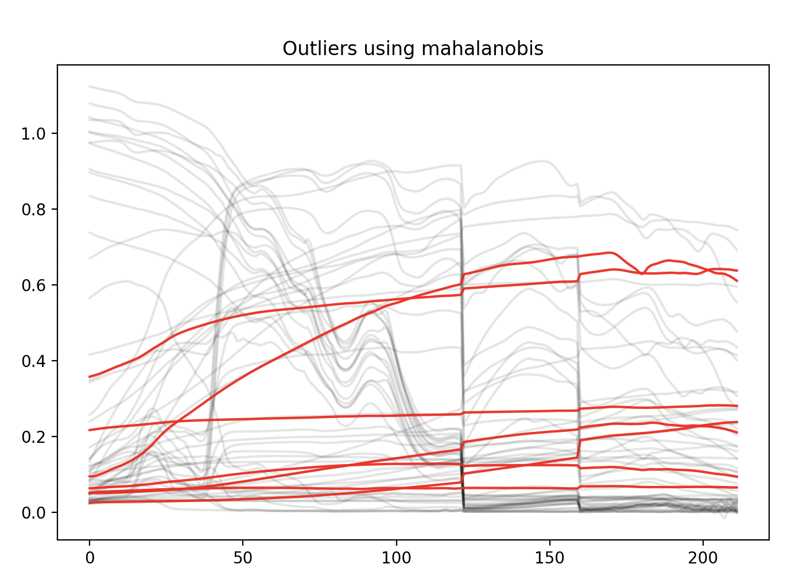

# Package

## Installation

## Example Usage
### Train Time
```
from cover_class.train import setup_training_from_config

dataloader, X_test, Y_test = setup_training_from_config(
    '/my/path/config.yaml',
    batch_size,
    shuffle = True,
)
```

To get the dirichlet fractions, after every iteration, check `dataloader.dataset.batch_dirichlet_fraction_store` for the fractions. (Assuming that `simulation.return_fractions` was set to `true` in dataloader.yml)

To generate a simulated test set:
```
from cover_class.train import test_data, test_labels, test_fractions = make_simulation_test_set(
    dataloader,
    simulated_test_set_n_rows = <some_number>
)
```

### Static Dataset Processing
This is to demonstrate how to create a standardized set of HDF5 datasets for training.
It gets the data matrix from a supported CSV format from either a VFS or downloaded through the network.
```
from cover_class.static.retrieval import generate_hdf5_from_config
generate_hdf5_from_config('/path/to/my/config.yml')
```

### Outlier Detection
A separate feature of the cover-class repository is the ability to utilize outlier detectors which will save out a png highlighting any outliers and provide the indices in the dataset of them. 

The current options availible are:
- z-score
- kmeans
- mahalanobis
- lof (Local Outlier Factor)

Example:
```
>>> import numpy as np
>>> my_data = np.load('my_data.npy')
>>> 
>>> from cover_class.outlier_detection import show_outliers
>>> kwargs = {'outlier_percentile': 80}
>>> show_outliers(my_data, 'mahalanobis', png_name='my-data-outliers.png', **kwargs)
array([ 2,  4,  5, 37, 50, 59, 60])
```

And an example of an output png:
